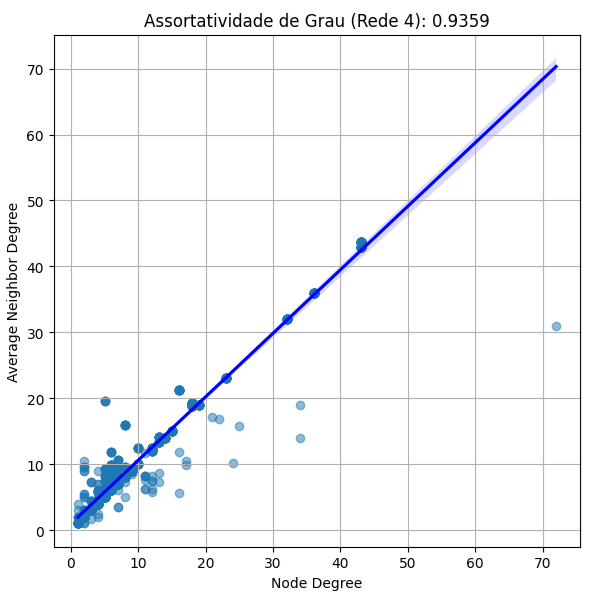

# Análise de Assortatividade de Grau em Redes de Coautoria

## Rede 1(ODS 01)

A **Rede 1** apresenta um coeficiente de assortatividade de grau de **0.8567**. Este valor indica uma forte tendência de que autores com um número similar de coautores colaboram entre si. Observa-se que, à medida que o grau do nó aumenta, o grau médio dos vizinhos também tende a aumentar, formando uma relação linear positiva. A maioria dos nós possui graus baixos a moderados, com poucos valores atípicos, ou seja, outliers, de graus mais elevados, sugerindo uma estrutura colaborativa bastante coesa entre os autores.

## Rede 2(ODS 09)

Na **Rede 2**, o coeficiente de assortatividade de grau é **0.9974**, o que indica uma relação quase perfeita entre o grau dos nós e o grau médio dos seus vizinhos. Esse alto coeficiente sugere uma forte tendência de homofilia, ou seja, há uma tendência dos nós de uma rede se conectarem a outros nós com características semelhantes, onde autores com muitos coautores tendem a colaborar com outros autores igualmente prolíficos, isso quer dizer que um nó está conectado a muitos outros nós. 
A relação linear muito próxima ao ideal sugere que há pouca variação na estrutura colaborativa desta rede, com uma alta concentração de colaborações entre autores de grau similar.

## Rede 3(ODS 11)

A **Rede 3** apresenta um coeficiente de assortatividade de grau de **0.9020**, indicando também uma forte tendência de assortatividade. Como nas redes anteriores, observa-se uma correlação positiva entre o grau dos nós e o grau médio dos vizinhos. Há uma maior dispersão nos graus médios dos vizinhos em nós de grau mais elevado, mas a tendência geral ainda reflete uma estrutura colaborativa onde autores de grau similar tendem a se agrupar. A presença de outliers com graus elevados e graus médios de vizinhos variáveis pode sugerir algumas colaborações excepcionais ou autores particularmente influentes.

## Rede 4(ODS 17)

Na **Rede 4**, o coeficiente de assortatividade de grau é **0.9359**, reforçando a tendência observada nas redes anteriores de que autores de graus similares tendem a colaborar entre si. A relação linear observada no gráfico é bastante clara, com a maioria dos autores colaborando com colegas que possuem um número similar de coautores. Como nas redes anteriores, há uma concentração de nós com graus baixos a moderados, mas também alguns nós de grau elevado que confirmam a presença de colaborações significativas entre autores prolíficos.