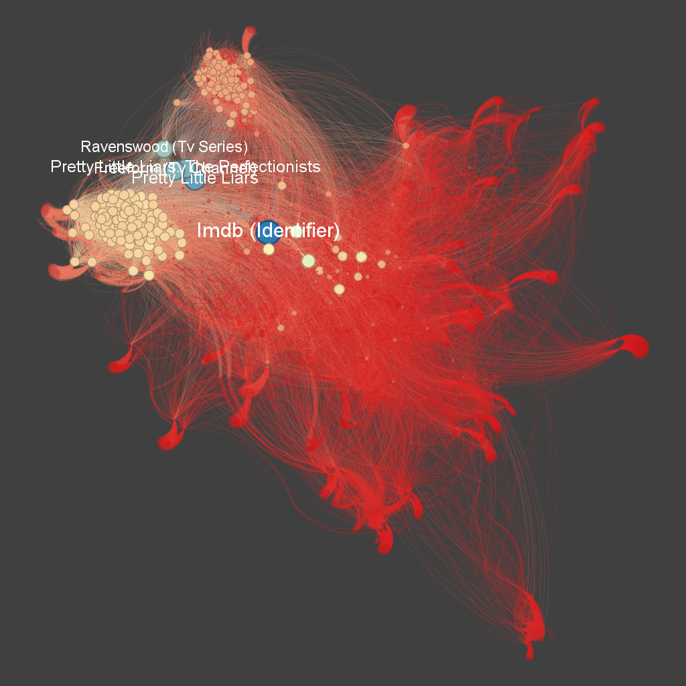
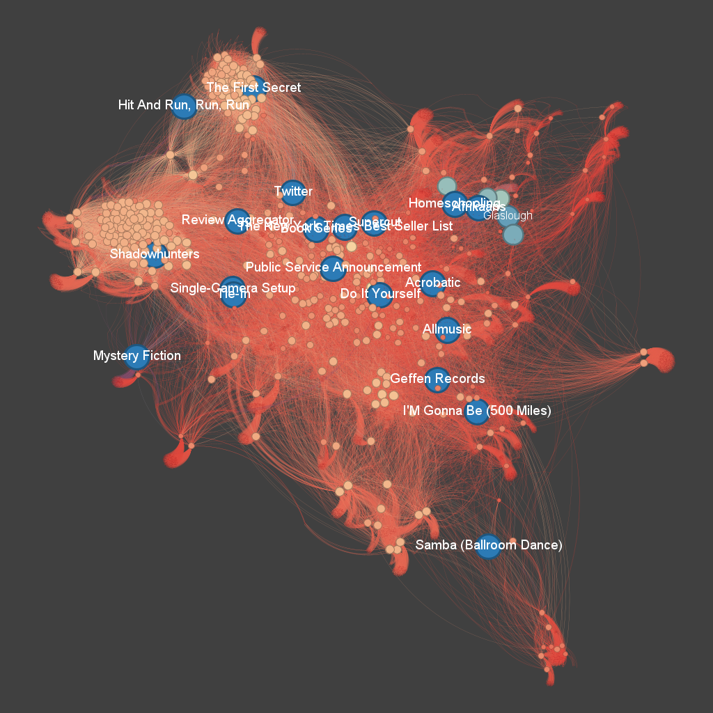
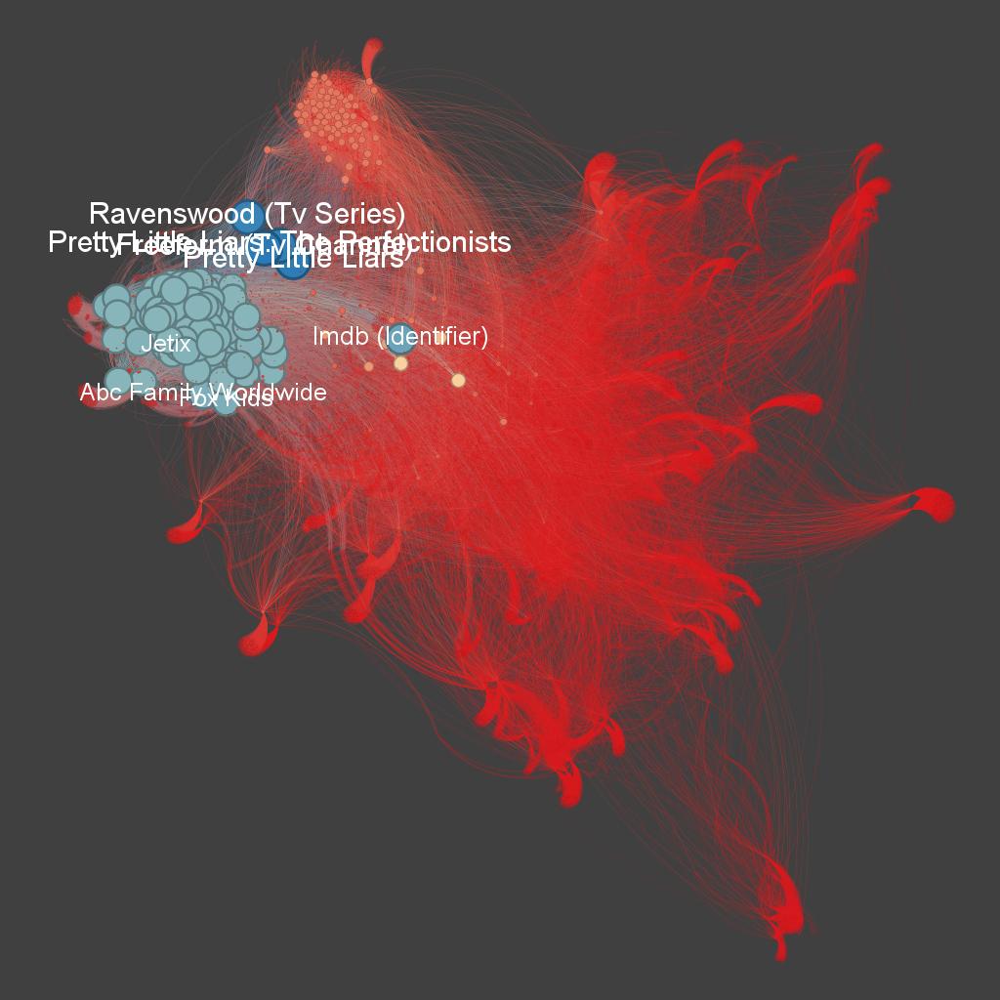

A centralidade de grau é uma medida simples e intuitiva em teoria de grafos. Ela indica a importância de um nó com base no número de conexões que ele possui. Em outras palavras, um nó com alta centralidade de grau está altamente conectado a outros nós na rede.

**Nós azuis**: Os nós conectados por arestas azuis possuem alta centralidade de grau. Isso significa que esses elementos estão fortemente conectados a muitos outros. Eles podem ser considerados os elementos centrais ou os eventos mais importantes.

**Nós amarelos**: Possuem uma média centralidade de grau. Isso significa que os elementos estão mediamente conectados a outros.

**Nós vermelhos**: Os nós conectados por arestas vermelhas tendem a ter baixa centralidade de grau. Eles podem representar elementos secundários.

A centralidade de proximidade (Closeness Centrality) é uma medida que indica o quão próximo um nó está de todos os outros nós na rede, em termos de distância geodésica (o caminho mais curto). Um nó com alta centralidade de proximidade pode acessar outros nós da rede de maneira mais eficiente.

**Nós azuis**: Os nós conectados por arestas azuis possuem alta centralidade de proximidade. Isso significa que esses elementos podem alcançar outros nós na rede com poucas conexões. Eles são frequentemente centrais e desempenham um papel importante na disseminação rápida de informações.

**Nós amarelos**: Esses nós têm uma centralidade de proximidade média. Eles estão razoavelmente próximos dos outros nós, mas não tanto quanto os nós com alta centralidade. Eles têm um papel de ligação, conectando subgrupos na rede.

**Nós vermelhos**: Os nós conectados por arestas vermelhas tendem a ter baixa centralidade de proximidade. Eles estão mais afastados dos outros nós e podem representar elementos periféricos ou secundários na rede, com menor influência ou acesso.

A centralidade de intermediação (Betweenness Centrality) é uma medida que avalia a importância de um nó com base na frequência com que ele aparece nos caminhos mais curtos entre outros nós. Um nó com alta centralidade de intermediação atua como um "ponto de passagem" crucial na rede, controlando o fluxo de informações entre diferentes partes da rede.

**Nós azuis**: Os nós conectados por arestas azuis possuem alta centralidade de intermediação. Isso significa que esses elementos frequentemente mediam as interações entre outros nós, controlando o fluxo de informações. Eles são pontos críticos na rede e têm uma grande influência na conectividade geral.

**Nós amarelos**: Esses nós têm uma centralidade de intermediação média. Eles são importantes como intermediários em alguns caminhos curtos, mas não são tão cruciais quanto os nós com alta centralidade. Eles desempenham um papel de suporte na interconectividade da rede.

**Nós vermelhos**: Os nós conectados por arestas vermelhas têm baixa centralidade de intermediação. Eles raramente aparecem nos caminhos mais curtos entre outros nós e, portanto, têm menos influência sobre o fluxo de informações na rede. Esses nós são mais periféricos e têm menos impacto na conectividade geral.

A centralidade de autovetor (Eigenvector Centrality) é uma medida que avalia a importância de um nó não apenas com base no número de suas conexões, mas também na qualidade dessas conexões. Em outras palavras, um nó tem alta centralidade de autovetor se estiver conectado a outros nós que também são altamente centrais.

**Nós azuis**: Os nós conectados por arestas azuis possuem alta centralidade de autovetor. Isso significa que esses nós estão conectados a outros nós que também são muito influentes na rede. Eles ocupam posições de destaque e são essenciais para a estrutura geral da rede.

**Nós amarelos**: Esses nós têm uma centralidade de autovetor média. Eles estão conectados a nós moderadamente importantes, desempenhando um papel significativo, mas não central, na rede. Eles ajudam a sustentar a estrutura, mas não têm a mesma influência que os nós de alta centralidade.

**Nós vermelhos**: Os nós conectados por arestas vermelhas têm baixa centralidade de autovetor. Eles estão conectados a nós menos influentes, o que os coloca em posições periféricas na rede. Esses nós têm menos impacto na conectividade e no poder de influência dentro da rede.

