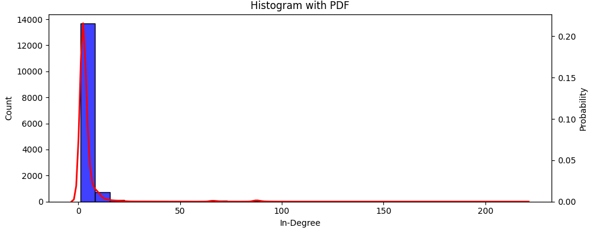

O histograma mostra a frequência com que cada valor de grau de entrada ocorre na rede. O CDF representa a proporção de nós que têm um grau de entrada menor ou igual a um determinado valor. 

O PDF mostra a probabilidade de um nó ter um determinado grau de entrada. A área sob a curva em um intervalo específico representa a probabilidade de um nó ter um grau de entrada dentro desse intervalo.
