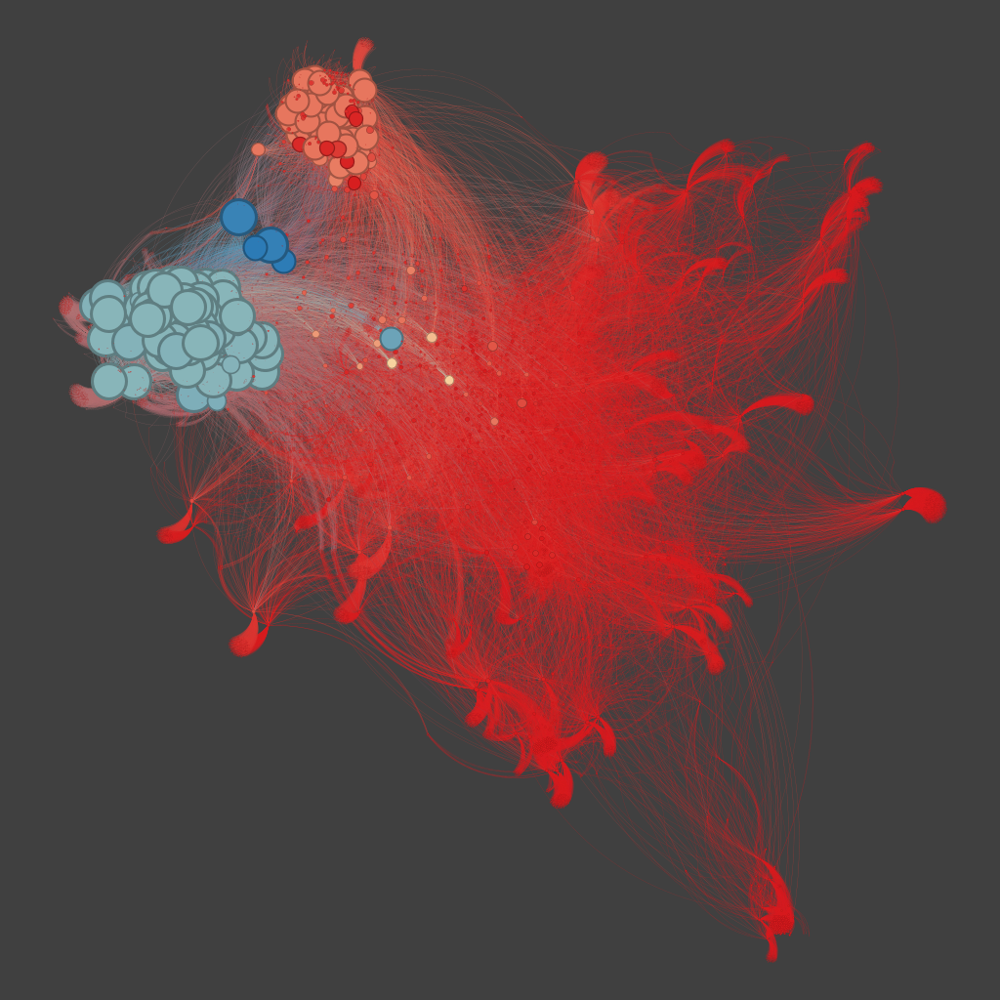
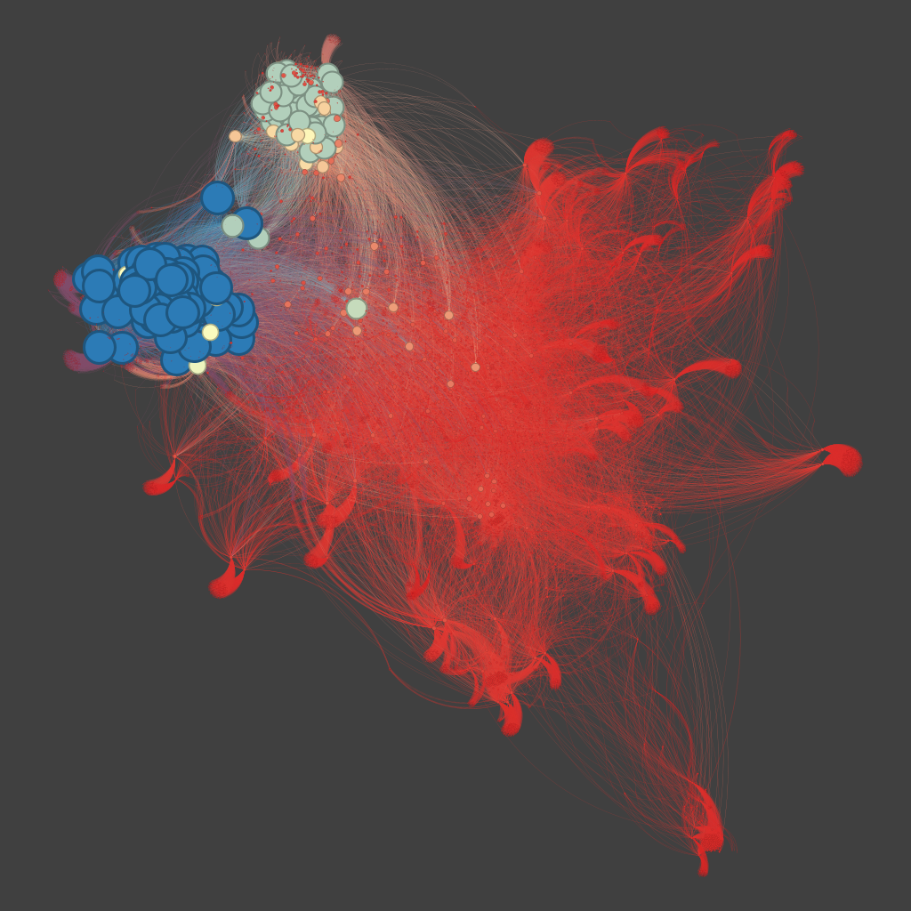

 O grafo destaca uma clara hierarquia na rede com base em valores de k-core. O conceito de k-core refere-se a um subgrafo máximo em que cada nó está conectado a pelo menos k outros nós dentro do subgrafo. Em outras palavras, um k-core é formado ao remover iterativamente todos os nós com grau menor que k, resultando em uma estrutura mais densa e coesa.

 Neste grafo, os nós em *vermelho* representam valores de k-core menores, ou seja, eles são menos conectados e mais periféricos. Estes nós possuem um número limitado de conexões e estão mais suscetíveis a serem removidos à medida que o valor de k aumenta.
Os nós em *azul* representam os valores de k-core maiores, indicando que esses nós estão fortemente conectados e possuem uma alta resiliência dentro da rede. Eles compõem o núcleo central da rede, sendo mais influentes e resistentes a perturbações.

 O grafo revela uma rede com um pequeno núcleo azul de alta conectividade (maior k-core), cercado por uma grande periferia vermelha com nós menos conectados (menor k-core).

 Esse grafo é uma representação visual do k-shell, onde os nós são organizados em camadas de acordo com seu nível de centralidade na rede. Os nós em vermelho representam camadas periféricas com valores de k-shell mais baixos, enquanto os nós em azul indicam as camadas mais internas, com valores de k-shell mais altos.

 O k-shell é uma técnica eficaz para avaliar a importância dos nós em uma rede complexa. Na imagem, o núcleo azul denso identifica os nós mais centrais e críticos, aqueles com maior conectividade e resiliência dentro da rede. Já os nós periféricos, em vermelho, são menos conectados e têm menor influência estrutural.

 A análise por k-shell permite identificar quais nós são essenciais para manter a integridade da rede e quais são menos cruciais. 

